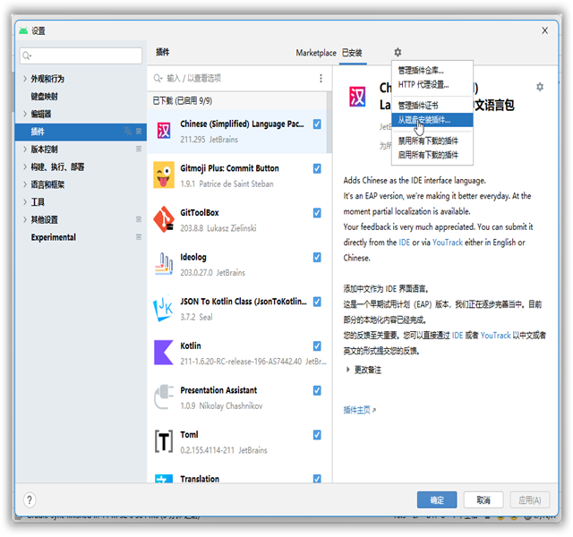
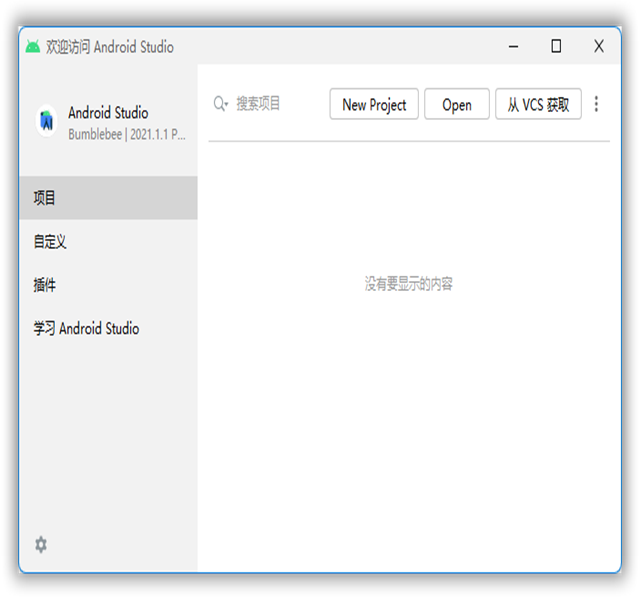
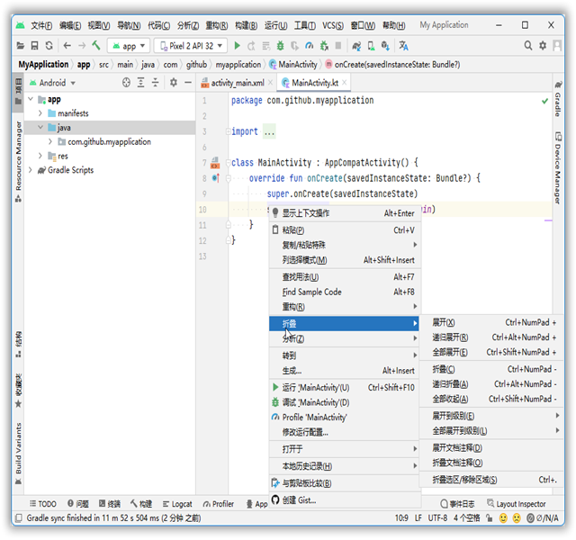
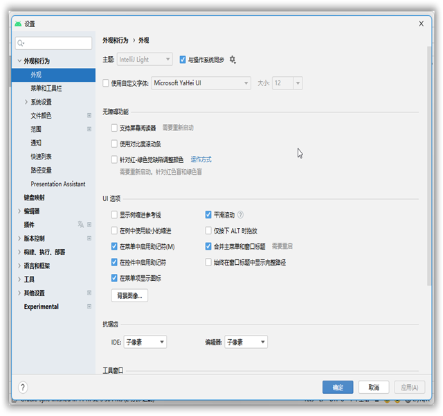
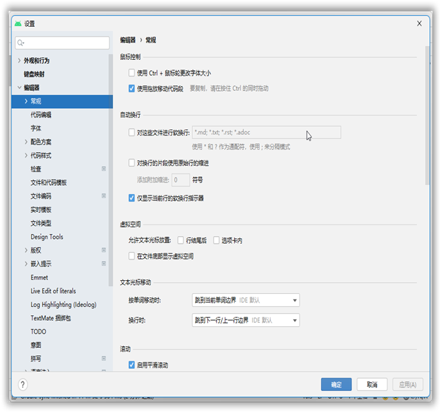

# AndroidStudio Chinese Language Pack

## 说明

根据IDEA插件修改而来，兼容AndroidStudio版本。插件原地址：

<https://plugins.jetbrains.com/plugin/index?xmlId=com.intellij.zh>

## 使用

AndroidStudio->设置->插件->从磁盘安装插件->下载的jar包->重启AndroidStudio



## 下载

进入release下载对应的版本即可：[release](https://github.com/sollyu/AndroidStudioChineseLanguagePack/releases)

## 预览






## 其他

> 因为语言包不需要更新的特别频繁并且本仓库只在Release更新，为了让大家知道这个不是一个死库，所以有了这句话。
> 
> 最后编辑时间：2023-09-04

## LICENSE

```c++
/*
 * Copyright (C) 2022. sollyu
 *
 * Licensed under the Apache License, Version 2.0 (the "License");
 * you may not use this file except in compliance with the License.
 * You may obtain a copy of the License at
 *
 *         http://www.apache.org/licenses/LICENSE-2.0
 *
 * Unless required by applicable law or agreed to in writing, software
 * distributed under the License is distributed on an "AS IS" BASIS,
 * WITHOUT WARRANTIES OR CONDITIONS OF ANY KIND, either express or implied.
 * See the License for the specific language governing permissions and
 * limitations under the License.
 */
```
